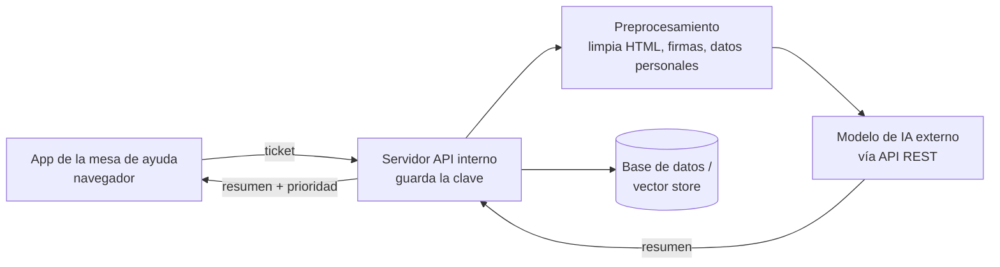

# PF1822 · Módulo 2 · C2 — Actividades prácticas con respuesta modelada

**Estado:** borrador · **Va en:** Anexo N°2, sección VI b) · **Guía:** Anexo N°7, num. 7, pág. 109
**Para el 7,0:** 2 actividades prácticas distintas que permitan adquirir la habilidad.
Siguen el ejemplo de la guía (pág. 110): una de **resolución de problemas** apoyada en
tutoriales y videos, y otra de **análisis de caso** con **gamificación y simulación**,
ambas con respuesta modelada.

> **Aviso para quien revise:** el código de las respuestas modeladas está escrito y revisado
> a mano, pero **no se ejecutó** en la máquina donde se produjo este kit (no tiene Python).
> Antes de publicarlo, el tutor lo corre una vez con `pytest` y con una clave de prueba.

| | Actividad 1 | Actividad 2 |
| --- | --- | --- |
| Nombre | Un cliente de API para el resumidor | Laboratorio de prompts y métricas |
| Técnica | Resolución de problemas | Análisis de caso + simulación con tablero de puntajes |
| AE que cubre | AE1, AE2 | AE3, AE4 |
| Indicadores | 1.2, 1.3, 2.1, 2.2, 2.3 | 3.1, 3.2, 3.3, 4.1, 4.2, 4.3 |
| Tramo del módulo | 1 y 2 | 3 y 4 |
| Tiempo estimado | 6 h (2 h guiadas + 4 h autónomas) | 6 h (1,5 h sincrónica + 4,5 h autónomas) |
| Apoyos | Notebook guiado R05, cápsulas R03 | Video interactivo R06 |
| Producto | Diagrama + `cliente_ia.py` + `test_cliente_ia.py` | Notebook del pipeline + registro de prompts + tabla de métricas |
| Se evalúa con | Rúbrica de solución (B2-1) | Rúbrica de solución (B2-1) + bitácora (B4-d) |

---

## Actividad 1 · Un cliente de API para el resumidor

### Enunciado para el participante

La mesa de ayuda de Nube Sur (empresa ficticia) quiere un resumidor de tickets. Antes de
escribir prompts, el equipo necesita dos cosas: saber cómo va a estar armada la aplicación
y tener una pieza de código confiable para hablar con el modelo.

**Parte A — Arquitectura (AE1).** Dibuja el diagrama funcional del resumidor con estos
componentes: la aplicación de la mesa de ayuda (cliente), el servidor que expone la API
interna, el módulo de preprocesamiento, el modelo de IA externo y una base de datos o
*vector store*. Explica en una línea qué hace cada uno y responde: **¿dónde se guarda la
clave de la API y por qué no puede estar en el cliente?** Justifica tu arquitectura con dos
criterios: escalabilidad, seguridad, costo o mantenimiento.

**Parte B — Cliente de API (AE2).** Programa en Python el módulo `cliente_ia.py` con una
clase `ClienteIA` que:
1. lea la clave y los nombres de modelo desde **variables de entorno**, nunca desde el código;
2. liste los modelos disponibles con una solicitud **GET**;
3. genere texto con una solicitud **POST** al endpoint de chat, con `temperature` y límite de tokens configurables, y devuelva el texto y los tokens usados;
4. obtenga **embeddings** de una lista de textos con una solicitud **POST**;
5. informe los errores HTTP con un mensaje claro;
6. esté documentada con **docstrings**.

Escribe además `test_cliente_ia.py` con **al menos tres pruebas unitarias** que se ejecuten
**sin conexión**, simulando la API.

**Entrega:** el diagrama (imagen o Mermaid), los dos archivos `.py`, la salida de `pytest`
y un `README.md` breve. Tu clave **no** puede aparecer en ningún archivo ni captura.

### Respuesta modelada

**Parte A — diagrama de referencia:**



| Componente | Función |
| --- | --- |
| App de la mesa de ayuda | Muestra el ticket y su resumen; nunca conoce la clave. |
| Servidor API interno | Recibe el ticket, orquesta el flujo y es el único que guarda la clave (variable de entorno). |
| Preprocesamiento | Limpia el texto y quita datos personales antes de enviarlo: menos tokens y menos riesgo. |
| Modelo de IA externo | Genera el resumen y los embeddings. |
| Base de datos / vector store | Guarda tickets, resúmenes y embeddings para buscar tickets parecidos. |

*Por qué la clave no va en el cliente:* todo lo que llega al navegador puede leerlo
cualquiera; una clave expuesta se usa para gastar a cuenta de la empresa.
*Justificación modelo:* **seguridad**, porque la clave y los datos personales quedan del lado
del servidor; **escalabilidad**, porque el servidor puede encolar tickets y procesarlos en
lote sin cambiar la aplicación de la mesa de ayuda.

**Parte B — `cliente_ia.py` de referencia:**

```python
"""Cliente mínimo y reutilizable para APIs de modelos generativos compatibles con OpenAI."""
from __future__ import annotations

import os

import httpx


class ErrorAPI(Exception):
    """Error devuelto por la API, con su código HTTP y el mensaje del servicio."""

    def __init__(self, estado: int, mensaje: str):
        super().__init__(f"HTTP {estado}: {mensaje}")
        self.estado = estado
        self.mensaje = mensaje


class ClienteIA:
    """Encapsula las llamadas de listado de modelos, generación y embeddings.

    Args:
        base_url: URL base de la API, por ejemplo "https://api.openai.com/v1".
        clave_api: clave de acceso. Si es None, se lee de la variable OPENAI_API_KEY.
        modelo_chat: modelo de generación. Si es None, se lee de MODELO_CHAT.
        modelo_embeddings: modelo de embeddings. Si es None, se lee de MODELO_EMBEDDINGS.
        timeout: segundos máximos de espera por solicitud.
        http: cliente httpx ya construido; las pruebas lo usan para simular la API.
    """

    def __init__(self, base_url: str = "https://api.openai.com/v1", clave_api: str | None = None,
                 modelo_chat: str | None = None, modelo_embeddings: str | None = None,
                 timeout: float = 30.0, http: httpx.Client | None = None):
        self.clave_api = clave_api or os.environ.get("OPENAI_API_KEY")
        if not self.clave_api:
            raise ValueError("Falta OPENAI_API_KEY: defínela en el entorno, nunca en el código.")
        self.modelo_chat = modelo_chat or os.environ.get("MODELO_CHAT")
        self.modelo_embeddings = modelo_embeddings or os.environ.get("MODELO_EMBEDDINGS")
        self.http = http or httpx.Client(base_url=base_url, timeout=timeout)
        self.http.headers["Authorization"] = f"Bearer {self.clave_api}"

    def _revisar(self, respuesta: httpx.Response) -> dict:
        """Devuelve el JSON de la respuesta o lanza ErrorAPI si el estado es 400 o más."""
        if respuesta.status_code >= 400:
            raise ErrorAPI(respuesta.status_code, respuesta.text[:300])
        return respuesta.json()

    def listar_modelos(self) -> list[str]:
        """Devuelve los identificadores de los modelos disponibles (GET /models)."""
        datos = self._revisar(self.http.get("/models"))
        return [m["id"] for m in datos.get("data", [])]

    def generar(self, mensajes: list[dict], temperature: float = 0.2, max_tokens: int = 300) -> dict:
        """Envía una conversación al endpoint de chat (POST /chat/completions).

        Args:
            mensajes: lista de {"role": "system" | "user" | "assistant", "content": str}.
            temperature: aleatoriedad de la respuesta; baja para resúmenes consistentes.
            max_tokens: máximo de tokens de la respuesta.

        Returns:
            {"texto": str, "tokens": dict} con el texto generado y el uso de tokens.
        """
        if not self.modelo_chat:
            raise ValueError("Falta el modelo: define MODELO_CHAT.")
        datos = self._revisar(self.http.post("/chat/completions", json={
            "model": self.modelo_chat, "messages": mensajes,
            "temperature": temperature, "max_tokens": max_tokens,
        }))
        return {"texto": datos["choices"][0]["message"]["content"], "tokens": datos.get("usage", {})}

    def embeddings(self, textos: list[str]) -> list[list[float]]:
        """Devuelve un vector por texto, en el mismo orden de entrada (POST /embeddings)."""
        if not self.modelo_embeddings:
            raise ValueError("Falta el modelo: define MODELO_EMBEDDINGS.")
        datos = self._revisar(self.http.post("/embeddings", json={
            "model": self.modelo_embeddings, "input": textos,
        }))
        return [d["embedding"] for d in sorted(datos["data"], key=lambda d: d["index"])]
```

**`test_cliente_ia.py` de referencia** (sin conexión, con `httpx.MockTransport`):

```python
import httpx
import pytest

from cliente_ia import ClienteIA, ErrorAPI


def cliente_simulado(cuerpo: dict, estado: int = 200, registro: list | None = None) -> ClienteIA:
    """Crea un ClienteIA cuyas solicitudes responde una API falsa."""
    def responder(solicitud: httpx.Request) -> httpx.Response:
        if registro is not None:
            registro.append(solicitud)
        return httpx.Response(estado, json=cuerpo)

    http = httpx.Client(base_url="https://api.test/v1", transport=httpx.MockTransport(responder))
    return ClienteIA(clave_api="clave-de-prueba", modelo_chat="modelo-x",
                     modelo_embeddings="embeddings-x", http=http)


def test_generar_devuelve_texto_tokens_y_autentica():
    registro = []
    cliente = cliente_simulado({"choices": [{"message": {"content": "Resumen"}}],
                                "usage": {"total_tokens": 42}}, registro=registro)
    respuesta = cliente.generar([{"role": "user", "content": "hola"}])
    assert respuesta == {"texto": "Resumen", "tokens": {"total_tokens": 42}}
    assert registro[0].method == "POST"
    assert registro[0].url.path == "/v1/chat/completions"
    assert registro[0].headers["Authorization"] == "Bearer clave-de-prueba"


def test_embeddings_respeta_el_orden_de_entrada():
    cliente = cliente_simulado({"data": [{"index": 1, "embedding": [0.3]},
                                         {"index": 0, "embedding": [0.1]}]})
    assert cliente.embeddings(["a", "b"]) == [[0.1], [0.3]]


def test_listar_modelos_usa_get():
    registro = []
    cliente = cliente_simulado({"data": [{"id": "m1"}, {"id": "m2"}]}, registro=registro)
    assert cliente.listar_modelos() == ["m1", "m2"]
    assert registro[0].method == "GET"


def test_error_http_se_informa_con_su_codigo():
    cliente = cliente_simulado({"error": {"message": "clave inválida"}}, estado=401)
    with pytest.raises(ErrorAPI) as error:
        cliente.generar([{"role": "user", "content": "hola"}])
    assert error.value.estado == 401


def test_sin_clave_no_arranca(monkeypatch):
    monkeypatch.delenv("OPENAI_API_KEY", raising=False)
    with pytest.raises(ValueError):
        ClienteIA()
```

Salida esperada: `5 passed`.

**Uso con Hugging Face.** La misma clase sirve con cualquier API compatible con el formato
de OpenAI cambiando `base_url`, la clave y el modelo. `PENDIENTE:` el tutor confirma en la
documentación vigente de Hugging Face (Inference Providers) la URL base compatible y un
modelo de ejemplo antes de publicar la actividad; las URL de ese servicio han cambiado.

**Nota sobre parámetros.** Algunos modelos recientes piden `max_completion_tokens` en vez de
`max_tokens` o no aceptan `temperature`. El participante lo comprueba en la documentación
del modelo que use: es parte del indicador 2.1.

**Errores típicos:** la clave escrita en el código o en el notebook (falla grave, criterio 2
de la rúbrica); pruebas que llaman a la API real y fallan sin internet; no revisar el código
de estado y leer `choices` de una respuesta de error.

---

## Actividad 2 · Laboratorio de prompts y métricas

### Enunciado para el participante

El jefe de soporte de Nube Sur va a elegir **una** configuración para el resumidor y quiere
evidencia, no opiniones. Te entrega 5 tickets reales (anonimizados, ficticios para el curso)
con el resumen que escribió una persona de su equipo para cada uno. Tu misión es simular la
decisión: preparar los tickets, probar estrategias de prompt y medir cuál resume mejor.

1. **Preprocesa (AE4).** Programa funciones que limpien HTML y firmas, reemplacen correos y
   enlaces por marcas, normalicen espacios y tokenicen. Explica con un ticket qué cambió.
2. **Diseña (AE3).** Escribe un prompt **zero-shot** y uno **few-shot** (con dos ejemplos)
   para resumir un ticket en una oración de máximo 25 palabras.
3. **Itera (AE3).** Registra al menos tres versiones del prompt con qué cambiaste y qué
   efecto tuvo. Prueba cada estrategia con `temperature` 0,2 y 0,9.
4. **Mide (AE4).** Calcula ROUGE-1, ROUGE-L y BLEU de cada resumen contra la referencia,
   valora coherencia y relevancia de 1 a 3, y registra todo en `resultados.csv`.
5. **Decide.** Recomienda una configuración en 5 líneas, con números.

**Tablero del laboratorio (gamificación):** cada participante publica en el LMS su mejor
ROUGE-L promedio y la configuración que lo logró. Hay insignias para **"Mejor ROUGE-L"**,
**"Prompt más corto con ROUGE-L sobre 0,5"** y **"Mejor bitácora de iteraciones"** (esta la
elige el tutor). Lo que puntúa en la nota no es el primer lugar, sino el proceso registrado.

### Insumos que entrega el LMS

| id | Ticket (tal como llega) | Resumen de referencia |
| --- | --- | --- |
| T1 | `<p>Hola equipo,</p><p>Desde ayer en la tarde no puedo iniciar sesión en la app de facturación después de cambiar mi contraseña. Me dice "credenciales inválidas" aunque estoy segura de que la escribo bien.</p><p>Saludos,<br>Marta</p>` + firma `-- Marta Vidal · Contabilidad · marta.vidal@cliente.test` | El usuario no puede iniciar sesión en la app de facturación tras cambiar su contraseña. |
| T2 | `Buenas, el reporte mensual de ventas en PDF sale con las tildes rotas (aparece "Compañía"). Pasa desde la actualización del lunes. Enviado desde mi teléfono` | El reporte mensual de ventas en PDF muestra caracteres rotos desde la actualización del lunes. |
| T3 | `URGENTE!!! la API de pagos responde error 504 en el 30% de las llamadas desde las 09:00, afecta a clientes en Chile y Perú. Logs: https://logs.nubesur.test/abc` | La API de pagos devuelve error 504 en parte de las llamadas desde las 09:00 en Chile y Perú. |
| T4 | `Hola, ¿se puede exportar el listado de clientes a Excel? No encuentro la opción en el panel. Gracias` | El usuario pregunta cómo exportar el listado de clientes a Excel desde el panel. |
| T5 | `El botón "Guardar" del formulario de proveedores no hace nada en Firefox; en Chrome funciona bien. Probé borrando caché.` | El botón Guardar del formulario de proveedores no funciona en Firefox. |

Todos los nombres, correos y dominios son ficticios (el dominio `.test` está reservado).

### Respuesta modelada

**1 · Preprocesamiento (`preprocesar.py`):**

```python
"""Limpieza, normalización y tokenización de tickets antes de enviarlos al modelo."""
import html
import re
import unicodedata

import spacy

nlp = spacy.load("es_core_news_sm")  # python -m spacy download es_core_news_sm


def limpiar(texto: str) -> str:
    """Quita HTML, firma y datos personales; deja un texto listo para el modelo."""
    texto = html.unescape(texto)
    texto = re.sub(r"<br\s*/?>|</p>", "\n", texto, flags=re.IGNORECASE)
    texto = re.sub(r"<[^>]+>", " ", texto)                   # resto de etiquetas HTML
    texto = re.split(r"\n\s*--\s", texto)[0]                 # todo lo que sigue a la firma "-- "
    texto = re.sub(r"Enviado desde mi \w+", " ", texto, flags=re.IGNORECASE)
    texto = re.sub(r"\S+@\S+", "[correo]", texto)            # datos personales fuera
    texto = re.sub(r"https?://\S+", "[enlace]", texto)
    texto = re.sub(r"!{2,}", "!", texto)
    return re.sub(r"\s+", " ", texto).strip()


def quitar_tildes(texto: str) -> str:
    """Pasa 'sesión' a 'sesion'; se usa solo para comparar textos al medir."""
    return "".join(c for c in unicodedata.normalize("NFD", texto) if unicodedata.category(c) != "Mn")


def tokenizar(texto: str, lematizar: bool = False, sin_stopwords: bool = False) -> list[str]:
    """Tokeniza con spaCy; opcionalmente lematiza y quita stopwords y puntuación."""
    tokens = []
    for t in nlp(texto.lower()):
        if t.is_punct or t.is_space or (sin_stopwords and t.is_stop):
            continue
        tokens.append(t.lemma_ if lematizar else t.text)
    return tokens


def ngramas(tokens: list[str], n: int = 2) -> list[tuple[str, ...]]:
    """Devuelve los n-gramas consecutivos de una lista de tokens."""
    return list(zip(*(tokens[i:] for i in range(n))))
```

*Ejemplo con T1:* `limpiar` deja "Hola equipo, Desde ayer en la tarde no puedo iniciar
sesión en la app de facturación después de cambiar mi contraseña. Me dice "credenciales
inválidas" aunque estoy segura de que la escribo bien. Saludos, Marta": se van las
etiquetas y la firma con el correo. `tokenizar(..., sin_stopwords=True)` deja, entre otros,
`iniciar`, `sesión`, `app`, `facturación`, `contraseña`. El problema de T2 ("Compañía")
**se conserva a propósito**: es parte del problema que reporta el cliente.

**2 · Prompts de referencia:**

*Zero-shot:*
```text
[system] Eres analista de soporte de Nube Sur. Resume el ticket en UNA oración de máximo
25 palabras, en español neutro, en tercera persona. Indica qué falla y en qué producto.
No agregues soluciones ni datos que no estén en el ticket.
[user] Ticket: <ticket limpio>
```

*Few-shot:* el mismo mensaje de sistema, seguido de dos ejemplos como turnos previos
(`user` con un ticket y `assistant` con su resumen) antes del ticket a resumir. Ejemplos
**distintos** de los cinco tickets evaluados, para no contaminar la medición:

```text
[user] Ticket: No me llegan los correos de recuperación de clave desde el viernes.
[assistant] El usuario no recibe los correos de recuperación de clave desde el viernes.
[user] Ticket: ¿Cómo agrego un segundo administrador a mi cuenta?
[assistant] El usuario pregunta cómo agregar un segundo administrador a su cuenta.
[user] Ticket: <ticket limpio>
```

**3 · Registro de iteraciones (ejemplo de nivel logrado):**

| Versión | Cambio | Efecto observado |
| --- | --- | --- |
| v1 | "Resume esto: <ticket>" | Resúmenes de 3 a 5 oraciones, a veces con soluciones inventadas. Falta **control**. |
| v2 | Rol de analista + "una oración, máximo 25 palabras" + "no agregues soluciones" | Largo correcto; T4 sale como instrucción ("Exporta el listado…") en vez de pregunta. Mejora la **estructura**. |
| v3 | "En tercera persona, indica qué falla y en qué producto" + few-shot con una pregunta de ejemplo | T4 queda "El usuario pregunta cómo…". Formato uniforme en los cinco. Mejora la **claridad**. |
| v3 · T=0,9 | Misma v3 con temperature 0,9 | Resúmenes más variados entre corridas y dos con palabras que no están en el ticket. Para esta tarea conviene **T=0,2**. |

**4 · Medición (`evaluar.py`):**

```python
"""Mide resúmenes generados contra referencias y registra los resultados."""
import csv
import re

from nltk.translate.bleu_score import SmoothingFunction, sentence_bleu
from rouge_score import rouge_scorer

from preprocesar import quitar_tildes


class TokenizadorES:
    """rouge-score descarta por defecto las letras con tilde; este tokenizador las conserva."""

    def tokenize(self, texto: str) -> list[str]:
        return re.findall(r"\w+", quitar_tildes(texto.lower()))


tok = TokenizadorES()
rouge = rouge_scorer.RougeScorer(["rouge1", "rougeL"], tokenizer=tok)
suavizado = SmoothingFunction().method1  # textos cortos: sin suavizado BLEU da 0 con facilidad


def medir(referencia: str, generado: str) -> dict:
    """Devuelve ROUGE-1, ROUGE-L (F1) y BLEU de un resumen frente a su referencia."""
    r = rouge.score(referencia, generado)
    bleu = sentence_bleu([tok.tokenize(referencia)], tok.tokenize(generado), smoothing_function=suavizado)
    return {"rouge1_f": round(r["rouge1"].fmeasure, 3), "rougeL_f": round(r["rougeL"].fmeasure, 3),
            "bleu": round(bleu, 3)}


def registrar(filas: list[dict], ruta: str = "resultados.csv") -> None:
    """Escribe el protocolo: una fila por ticket, estrategia y temperature."""
    campos = ["ticket", "estrategia", "version", "temperature", "rouge1_f", "rougeL_f", "bleu",
              "tokens", "coherencia_1a3", "relevancia_1a3", "comentario"]
    with open(ruta, "w", newline="", encoding="utf-8") as f:
        escritor = csv.DictWriter(f, fieldnames=campos)
        escritor.writeheader()
        escritor.writerows(filas)
```

*Cálculo de comprobación (para verificar que la métrica está bien armada).* Referencia de
T1: "El usuario no puede iniciar sesión en la app de facturación tras cambiar su
contraseña." Resumen generado de ejemplo: "Usuario no logra iniciar sesión en la app de
facturación después de cambiar la contraseña." Ambos tienen 15 palabras y comparten 11
(usuario, no, iniciar, sesión, en, la, app, de, facturación, cambiar, contraseña), que además
aparecen en el mismo orden. Por lo tanto **ROUGE-1 F1 = ROUGE-L F1 = 11/15 = 0,733**. Si el
participante obtiene un valor muy distinto con este par, su tokenizador está perdiendo las
palabras con tilde.

**Protocolo de coherencia y relevancia** (valoración humana, 1 a 3):
coherencia 3 = una oración gramatical y sin contradicciones; relevancia 3 = nombra la falla y
el producto del ticket sin agregar nada que no esté en él. Las valora el participante y el
tutor revisa una muestra.

**5 · Recomendación modelo:**
> Recomiendo few-shot v3 con temperature 0,2: obtuvo el ROUGE-L promedio más alto de las
> cuatro configuraciones, todos sus resúmenes tuvieron coherencia y relevancia 3, y fue la
> más estable entre corridas. El zero-shot quedó cerca en ROUGE pero falló el formato en T4.
> Con temperature 0,9 bajó la relevancia porque apareció información que no estaba en el
> ticket. Costo: el few-shot usa más tokens de entrada por los ejemplos; con 300 tickets
> diarios conviene medir si esa diferencia importa.

*(Los números de cada participante varían según el modelo y la corrida; lo que se evalúa es
que la recomendación se apoye en su propia tabla.)*

**Qué distingue una respuesta débil:** elige la configuración "que se ve mejor" sin tabla;
usa los mismos tickets de evaluación como ejemplos del few-shot; o reporta ROUGE calculado
con el tokenizador por defecto, que en español descarta las letras con tilde.
