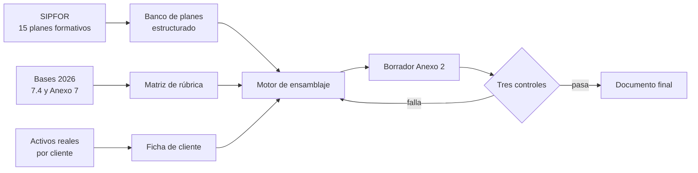

# 00 — El encargo

## En una frase

Construir una **fábrica de propuestas técnicas**: un sistema que produzca decenas de
Anexos 2 distintos entre sí, uno por cada combinación cliente × plan formativo, todos
alineados a la rúbrica de las bases 2026 y con sus verificadores funcionando.

No se trata de ser experto en licitaciones SENCE. Natalia ya lo es. Lo que no tiene es
capacidad de producción: el volumen que exige esta licitación no se escribe a mano en
dos semanas.

## Quién es quién

- **Natalia (hackea.pro)** — consultora que arma propuestas técnicas para organismos
  ejecutores. Contraparte del encargo.
- **Diego** — subcontratista. Aporta automatización, sistematización y control de calidad.
- **Los clientes** — OTEC, universidades y CFT que postulan. Compiten entre sí.

## Clientes

| Cliente | Slug | Tipo | Estado |
| --- | --- | --- | --- |
| Skillnest (ex Coding Dojo) | `skillnest` | Bootcamp tecnológico | Confirmado |
| Universidad Autónoma | `u-autonoma` | Universidad privada | Confirmado |
| Universidad Andrés Bello | `unab` | Universidad privada | Confirmado |
| Chile Conductores | `chile-conductores` | OTEC vertical | Por confirmar |
| CFT CENCO | `cft-cenco` | CFT | Por confirmar |
| CFT PUCV | `cft-pucv` | CFT | Por confirmar |

## La escala

15 planes formativos, 2.670 cupos totales.

- 3 clientes confirmados × 15 planes = **45 Anexos 2**
- 6 clientes × 15 planes = **90 Anexos 2**
- Cada uno debe ser distinto de los otros 44 u 89.
- Dos semanas a full ≈ 10 días hábiles → 4,5 a 9 documentos terminados por día.

Si escribir un Anexo 2 decente toma 4 horas, son 180 a 360 horas de redacción. Una
persona no llega. **La automatización no es un extra del proyecto: es la condición
para que el proyecto exista.**

## Los cinco encargos del correo inicial, traducidos

1. **Leer bases 2026, punto 7.4 (pág. 26-34) y Anexo 7 (pág. 96-115).**
   → Aprenderse la rúbrica. Es la especificación funcional del motor.
   Estado: **hecho**, ver `docs/01-guia-propuesta-tecnica.md`.
2. **Revisar la carpeta de Anexos 2 de referencia.**
   → Ingeniería inversa del producto final. Corpus de entrenamiento.
   Estado: **bloqueado**, falta acceso.
3. **Revisar, verificar y linkear los verificadores.**
   → Auditoría de evidencia. Ver `docs/04-verificadores-protocolo.md`.
   Estado: **bloqueado**, depende del 2.
4. **Paralelo bases 2026 vs. bases 2024.**
   → Diff regulatorio. Estado: **hecho**, ver `docs/02-diff-bases-2024-2026.md`.
5. **Alimentarse de los planes formativos SIPFOR en su última versión.**
   → Fuente de verdad del contenido. Estado: **pendiente**, es la primera tarea del motor.

## Plan en cuatro fases

| Fase | Cuándo | Entregable |
| --- | --- | --- |
| 0. Reconocimiento | Semana previa | Matriz de requisitos, auditoría de verificadores, diff de bases |
| 1. Motor | Semana previa al cierre | Banco SIPFOR + plantilla paramétrica + primer Anexo 2 generado y aprobado |
| 2. Producción | Las dos semanas a full | Los 45 a 90 Anexos 2, revisados, con verificadores vivos |
| 3. Sistematización | Semana posterior | Repositorio y manual reutilizables en la próxima licitación |

El hito que define el proyecto es el de la fase 1: **un** Anexo 2 generado
automáticamente y aprobado por Natalia. Con uno aprobado, los otros 89 son costo marginal.

## Arquitectura del motor

## Riesgos abiertos

| Riesgo | Impacto | Mitigación |
| --- | --- | --- |
| Propuestas demasiado parecidas entre clientes que compiten | Reputacional para Natalia, puntaje para los clientes | Control de similitud, `AGENTS.md` §6 |
| Verificadores caídos o que muestran contenido equivocado | Pérdida de puntaje o rechazo | `docs/04-verificadores-protocolo.md` |
| LMS a medio armar | 35% de la propuesta técnica se evalúa navegándolo | Definir temprano quién arma cuántos LMS |
| Alcance sube de 45 a 90 sin cambiar el pago | Económico | Precio por unidad, no monto fijo mensual |
| Ambigüedad "segundo módulo" vs. "todos los módulos" | Multiplica el trabajo por 12 | Consulta formal en los 5 días hábiles de aclaraciones |
