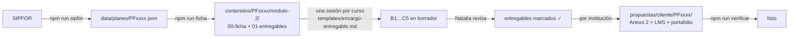

# 05 — Flujo para producir el contenido del módulo 2 de un curso

De un código de plan (`PF1821`) a los entregables del módulo evaluado, revisados y
listos para instanciar por institución. Las dos primeras etapas son automáticas; la
tercera es la producción de verdad y la cuarta es humana.



## Qué es de cada nivel

| Nivel | Dónde vive | Qué contiene | Quién lo ve |
| --- | --- | --- | --- |
| Plan (fuente) | `data/sipfor/`, `data/planes/` | Lo que dice SIPFOR, sin tocar | Todos |
| Curso (canónico) | `contenidos/<PF>/modulo-2/` | B1–B4, C1–C5 y actividades del módulo: lo fija el plan, no el oferente | Todos |
| Institución × curso | `propuestas/<cliente>/<PF>/` | Anexo 2, D1–D3, infraestructura, narrativa, LMS, portafolio | Solo esa institución |

**En `contenidos/` no va nada de ningún cliente.** Es la base común de todas las
instituciones que compiten entre sí, y el repo es público (`state/DECISIONS.md`, 2026-09-24).

## Etapa 0 — Extraer (automático, ~1 min)

```bash
npm run sipfor -- PF1821 PF1822
```

Lee la API pública del catálogo SIPFOR y escribe la respuesta tal cual en
`data/sipfor/<PF>/` y la forma normalizada en `data/planes/<PF>.json`. Avisa si la suma
de horas de los módulos no cuadra con el total del plan.

## Etapa 1 — Ficha y entregables (automático)

```bash
npm run ficha -- PF1821 PF1822
```

- `00-ficha-sipfor.md`: competencia, aprendizajes esperados, criterios, contenidos,
  recursos y perfil del facilitador del módulo 2, textuales. No se edita a mano.
- `01-entregables.md`: qué producir, con las cantidades del 7,0 ya calculadas para ese
  plan (por ejemplo, 4 aprendizajes esperados → 12 indicadores). Aquí se marca el avance.

## Etapa 2 — Producir el contenido canónico (una sesión por curso)

Un archivo por entregable en `contenidos/<PF>/modulo-2/`, en este orden, porque cada uno
se apoya en el anterior:

| Paso | Archivo | Por qué va en este lugar |
| --- | --- | --- |
| 1 | `B1-indicadores.md` | Los indicadores son la unidad de medida: todo lo demás los referencia |
| 2 | `C2-actividades.md` | Las dos actividades prácticas producen la evidencia que se evalúa y se publica |
| 3 | `B2-instrumentos.md` | Miden las actividades contra los indicadores: observación, desempeño y objetiva |
| 4 | `B3-portafolio.md` | Recoge la evidencia de las actividades en sus 6 elementos |
| 5 | `B4-retroalimentacion.md` | Feedback, autoevaluación, coevaluación y bitácora sobre lo anterior |
| 6 | `C4-herramientas-didacticas.md` | Tutorial y video que preparan para las actividades |
| 7 | `C-metodologia.md` | C1, C3 y C5: la narrativa que amarra todo a la competencia del módulo |
| 8 | `IV-actividades.md` | Horas y modalidad de todos los módulos del plan |

Cada archivo se encarga con `templates/encargo-entregable.md`, que fija las reglas que
más puntaje cuestan si se olvidan:

- Los aprendizajes esperados van **textuales** desde `00-ficha-sipfor.md`, con su id (AE1…AE4).
- Cada instrumento, actividad y evidencia dice qué AE cubre. La cobertura se cuenta.
- La metodología nombra herramientas, datos y productos **de este módulo**. Si el texto
  sirviera cambiando "n8n" por "Python", está mal: C1 es binario (7,0 o 1,0).
- Lo que el plan no dice y hace falta decidir se marca `PENDIENTE:`, no se inventa.

## Etapa 3 — Revisión humana

Natalia revisa cada archivo y se marca `[x]` en `01-entregables.md`. El panel del módulo 2
(`entregables/2026-09-24-modulo2/README.md`) refleja el mismo avance para quien no abre
el repo.

## Etapa 4 — Instanciar por institución

Con el canónico aprobado, cada institución toma su copia en `propuestas/<cliente>/<PF>/`
(ver `propuestas/README.md`) y agrega lo suyo: D1–D3, infraestructura, narrativa, LMS,
portafolio publicado y evidencia. Ahí corren los tres controles de `AGENTS.md` §7.

## Qué sigue sin resolverse

- Si se desarrolla solo el segundo módulo o todos (`state/OPEN-QUESTIONS.md` #1).
- Cómo se cuenta el "segundo módulo" cuando el plan empieza con un módulo transversal (#16).
