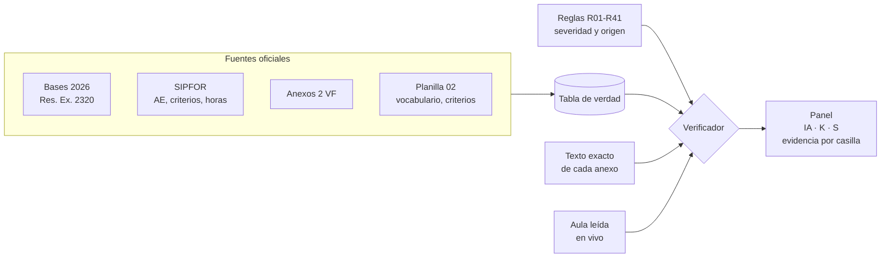
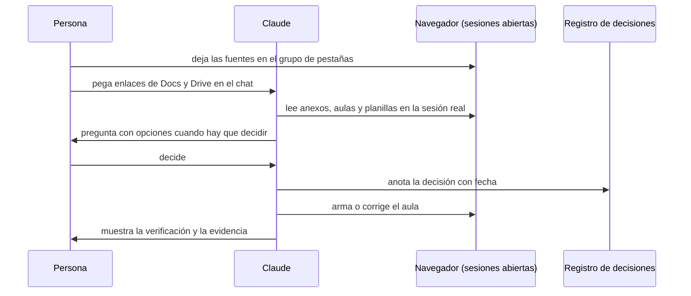

# Sistema Aulas y Anexos · Talento Digital 2026

Un método para que **26 aulas LMS** de cuatro clientes y sus **26 Anexos 2** digan lo mismo, con reglas escritas,
una sola tabla de verdad, un verificador automático y evidencia en cada resultado.

> **Ver la presentación:** [presentacion.html](presentacion.html) · **Reglas completas:** [REGLAS.md](REGLAS.md) ·
> **Verificador:** [`scripts/anexos/`](../scripts/anexos/) · **Skills:** [`.claude/skills/`](../.claude/skills/)

| 26 aulas | 4 plataformas | 41 reglas | 21 chequeos | 99,8 % alineación | 10/10 errores sembrados detectados |
|:-:|:-:|:-:|:-:|:-:|:-:|

---

## 1. La idea en una frase

**El anexo y el aula no se comparan entre sí: los dos se comparan con la tabla de verdad.** Si el anexo cuadra con la
tabla y el aula cuadra con la tabla, el anexo y el aula cuadran. Un dato se corrige en un solo lugar.



## 2. Qué fuente manda

Cuando dos fuentes no coinciden, manda la de más arriba:

1. La **decisión del equipo**, registrada con fecha en [`state/DECISIONS.md`](../state/DECISIONS.md).
2. Los **Anexos 2 VF** (en la evaluación del módulo manda el anexo).
3. El Word «Textos que se usaron en los anexos».
4. Los documentos 2024 «Contenidos Finales».

Aparte, el texto de los aprendizajes esperados y criterios sale siempre de **SIPFOR**, porque las bases sancionan
modificarlo (13.3.2 h).

## 3. La tabla de verdad

Una fila por anexo con lo que **debe** decir, cada dato con su fuente:

| Columna | Fuente |
|---|---|
| Cliente, plan, plataforma, aula, enlace del curso | Aulas 2026 (medidas el 04-10) |
| Nombre del plan, horas totales y suma de módulos | SIPFOR (`data/planes/*.json`) |
| Módulo 2: aprendizajes esperados y criterios (152 AE, 607 criterios) | SIPFOR + criterios faltantes de la planilla 02 |
| AE seleccionado y enlaces a lectura, quiz, infografía, ABP, ABPRO y evaluación | Aulas (id de cada actividad) |
| Vocabulario del cliente | Planilla 02, pestaña vocabulario |
| Documento del anexo en Drive | Carpeta Anexos 2 VF |

## 4. Las reglas

41 reglas en [`data/reglas/reglas.json`](../data/reglas/reglas.json), cada una con **severidad** (crítica, mayor,
menor), **origen** (numeral de las bases, SIPFOR o decisión de coordinación con fecha), **ámbito** (anexo, aula o
ambos) y los **chequeos** que la revisan. La lista completa está en [REGLAS.md](REGLAS.md), generada desde el JSON.

Grupos: fuentes · identidad del curso · estructura del aula · contenido por AE · actividades y evaluación ·
lenguaje · marca y vocabulario · evaluador y evidencia · Anexo 2.

## 5. Qué muestra cada LMS

Misma estructura en las 26 aulas: **bienvenida → cada aprendizaje esperado (lectura, ABP individual, ABPRO grupal,
quiz gamificado, infografía) → cierre (video resumen, evaluación del módulo, instrumentos, portafolio y bitácora)**,
con todos los módulos enunciados y solo el 2 desarrollado. Cambian la marca y los nombres:

| Cliente | Plataforma | Aulas | Lectura | ABP / ABPRO | Evaluación del módulo |
|---|---|:-:|---|---|---|
| UNAB | Moodle 4 | 8 | Lectura | ABP Trabajo individual / ABPRO Trabajo grupal | Evaluación del módulo |
| Coding Dojo · Skillnest | Moodle 4.5 | 8 | Material de estudio | Ejercicio ABP / Desarrollo de Proyecto ABPRO | Sprint de cierre |
| U. Autónoma | Canvas | 6 | Dossier de lectura | Ensayo individual / Laboratorio guiado | Prueba de desempeño |
| Chile Conductores | Moodle 3.8 | 4 | Material de lectura | Práctica supervisada individual / en equipo | Evaluación de desempeño |

## 6. Cómo se construye un verificador

Claude no opina anexo por anexo: escribe funciones que comparan, y las funciones deciden. Cada chequeo:

1. **Se ancla a una regla** del catálogo, de la que hereda severidad y origen.
2. **Toma el valor esperado de la tabla de verdad**, nunca del criterio del momento.
3. **Compara de forma determinista**: texto normalizado (sin tildes ni formato), conteos y direcciones web.
4. **Deja evidencia**: la cita del anexo y su sección, o el dato que falta. Las claves de evaluador se tapan.
5. **Responde en cuatro estados**: cumple, no cumple, requiere juicio o no aplica.
6. **Se prueba con errores sembrados**: errores conocidos metidos en copias de anexos que pasaban; deben detectarse todos.

| ID | Qué revisa | Regla |
|---|---|---|
| A01 | Código del plan correcto y sin códigos de otros planes | R35 |
| A02 | Nombre del curso igual al plan | R35 |
| A03 | Aprendizajes esperados del módulo 2 textuales (SIPFOR) | R38 |
| A04 | Criterios de evaluación textuales (SIPFOR + planilla 02) | R18 |
| A05 | Horas totales del plan | R36 |
| A06 | Nombra la plataforma real | R09 |
| A07 | Enlace directo al curso correcto | R40 |
| A08 | Todos los enlaces al LMS apuntan al aula correcta | R39 |
| A09 | Enlaces a lectura, quiz e infografía del AE seleccionado | R39 |
| A10 | Sin corchetes por completar | R41 |
| A11 | Sin notas de borrador | R41 |
| A12 | Nombre del archivo sin «V0» | R41 |
| A13 | Sin «Genially» (el quiz del aula es SCORM) | R41 |
| A14 | Sin «tramo» como nombre de un AE | R21 |
| A15 | Sin el dominio antiguo de Skillnest | R40 |
| A16 | Nube de al menos 12 GB por participante | R34 |
| A17 | Datos de acceso para evaluadores | R31 |
| A18 | Enlace al video o capturas de evidencia | R33 |
| J01 | Portafolio presentado como tarea del aula (juicio) | R25 |
| J02 | Promete videos por AE que el aula no tiene (juicio) | R14 |
| J03 | Nombres de recursos distintos a los del aula (juicio) | R29 |

## 7. La fórmula

```
IA  Índice de Alineación = Σ peso × [cumple]  ÷  Σ peso × [cumple o no cumple]
                           peso: crítica 3 · mayor 2 · menor 1 · los chequeos de juicio no pesan
K   Completitud          = casillas evaluadas ÷ (anexos esperados × chequeos)
    Estado del anexo     = BLOQUEADO  si no se leyó o falla un chequeo crítico
                           OBSERVADO  si IA < 100 % o queda juicio pendiente
                           LISTO      si IA = 100 % y sin juicio
S   Sensibilidad         = errores sembrados detectados ÷ errores sembrados
```

Si la suma de casillas no cuadra con anexos × chequeos, el programa se detiene: nada se salta en silencio.

## 8. Resultado del 8 de octubre

| Medida | Valor |
|---|---|
| Índice de Alineación global | **99,8 %** |
| Completitud | 96,2 % (525 de 546 casillas; un anexo no se pudo leer desde Drive) |
| Estados | 3 listos · 22 observados · 1 bloqueado |
| Casillas | 452 cumple · 2 no cumple · 54 requieren juicio · 17 no aplica · 21 sin leer |
| Sensibilidad | **100 %** (10 de 10 errores sembrados detectados) |

Los 25 anexos leídos traen los aprendizajes esperados y los 607 criterios con las palabras de SIPFOR, el código del
plan correcto, la plataforma real y ningún corchete pendiente. Las casillas en juicio (AE seleccionado distinto al de la
tabla, enlaces posteriores al 04-10, nombres de recursos) quedan para decisión del equipo. El detalle por anexo, con
citas, vive en un panel privado porque contiene texto de los anexos.

## 9. Por qué confiar

- **Texto exacto, no transcrito.** Cada anexo se lee desde Drive y se guarda tal cual; Claude nunca lo copia a mano.
- **Evidencia en cada casilla.** Sin cita no hay «cumple».
- **Errores sembrados.** Código cambiado, corchete, «Moodle» en un anexo de Canvas, enlace al curso roto, AE alterado,
  dominio antiguo, «tramo», «Genially», nube de 5 GB y nota de borrador: los 10 detectados.
- **Calibrado.** Se revisaron a mano los fallos de la primera corrida y se corrigieron cinco falsos positivos (el
  «canvas» de n8n, «dependiente:», «un tramo de diez minutos», «Full Stack» / «Fullstack», nombres de archivo entre
  corchetes). Después se volvió a correr la prueba sembrada.
- **Aula en vivo.** Los enlaces que no estaban en la tabla se comprobaron en Canvas por API (solo lectura): existen y
  están publicados.
- **Auditoría cruzada.** Cada sesión queda en [`state/LEDGER.csv`](../state/LEDGER.csv) y la audita otra herramienta
  ([`AUDITORIA.md`](../AUDITORIA.md)).

## 10. Método de trabajo: operación asistida

**La persona conduce, Claude opera.**



- **Sesión real en vez de credenciales.** Tres Moodle, Canvas, Drive, Rise y Canva ya estaban abiertos en el navegador.
  Claude trabajó dentro de esas sesiones: no se compartieron contraseñas, no se pidieron tokens a los administradores, y
  cada acción quedó a la vista. Claude podía hacer exactamente lo que la cuenta podía hacer. Cuando un sitio pedía
  iniciar sesión, la contraseña la escribía la persona.
- **El grupo de pestañas como mesa de trabajo.** Claude trabaja en un grupo de pestañas propio. Ahí se dejaban las
  fuentes del día (la carpeta de anexos, el anexo en revisión, el aula abierta en la sección exacta) y Claude las leía
  directo, sin descargas ni copiar y pegar texto.
- **Entrega de insumos por enlace.** Unos 60 mensajes con enlaces pegados, casi todos de Docs y Drive. Un enlace dice
  qué documento y qué versión sin ambigüedad, y Claude lo abre en la misma sesión.
- **Las decisiones son humanas y quedan escritas.** Unas 165 preguntas con opciones; cada respuesta quedó registrada,
  así se aplica igual en las 26 aulas y no se vuelve a preguntar.
- **Límites fijos.** Contraseñas, publicar, borrar, matricular y cambiar permisos: siempre con OK explícito o a mano.

Orden de magnitud (registros de 36 sesiones): ~4.800 acciones en el navegador, ~750 operaciones en Drive, ~200
subagentes en paralelo, dos computadores coordinados por este repositorio.

## 11. Skills

Una skill es un manual que Claude carga cuando la tarea lo pide: pasos, trampas conocidas, límites y cómo verificar.

| Skill | Para qué |
|---|---|
| [`reglas-aula`](../.claude/skills/reglas-aula/SKILL.md) | Revisar un texto o un aula contra las 41 reglas antes de publicar |
| [`cruce-anexo`](../.claude/skills/cruce-anexo/SKILL.md) | Leer los anexos sin transcribirlos, correr el verificador y entregar el panel |
| [`armar-aula-moodle`](../.claude/skills/armar-aula-moodle/SKILL.md) | Armar o corregir aulas en los tres Moodle |
| [`armar-aula-canvas`](../.claude/skills/armar-aula-canvas/SKILL.md) | Armar o corregir aulas en Canvas por API |
| [`subir-scorm`](../.claude/skills/subir-scorm/SKILL.md) | Generar y subir el quiz gamificado y las lecturas Rise |
| [`evidencia-video`](../.claude/skills/evidencia-video/SKILL.md) | Grabar el recorrido del participante para la sección VIII |

## 12. Conectores y tokens

| Herramienta | Para qué sirve | Qué pide |
|---|---|---|
| Plugin **Data** (Anthropic) | `build-dashboard` arma paneles con filtros desde el CSV de resultados; `validate-data` revisa conteos y porcentajes antes de entregar | Instalarlo; no pide tokens |
| Conector **Google Sheets** | La tabla de verdad como planilla editable | Conectar la cuenta de Google |
| **Moodle** web services (MCP o script) | Leer el contenido real del aula (`core_course_get_contents`) sin navegador | Un token de acceso. Sin ser administrador, solo si el sitio tiene el servicio móvil activo (dura ~12 semanas); si no, lo crea el administrador. Equivale a la sesión: variables de entorno, nunca en el repo |
| **Canvas** API (MCP o script) | Leer módulos, ítems, páginas y tareas con ids exactos | Token personal (Cuenta › Configuración › Integraciones aprobadas), salvo que la universidad lo restrinja. Tiene todos los permisos de la cuenta: usarlo solo para leer y con expiración |

Mientras haya sesiones abiertas en el navegador, la lectura en vivo funciona sin tokens. Los tokens convienen para
correr el cruce sin navegador o de forma programada.

## 13. Cómo se corre

```bash
node privado/verificador-anexos/construir-tabla.mjs   # tabla de verdad desde las fuentes
npm run anexos                                         # verificador + prueba sembrada → resultados y panel
npm run reglas                                         # regenera sistema/REGLAS.md desde data/reglas/reglas.json
```

`privado/` no se versiona: ahí quedan los textos de los anexos, la tabla con ids de aulas y los resultados con citas.
